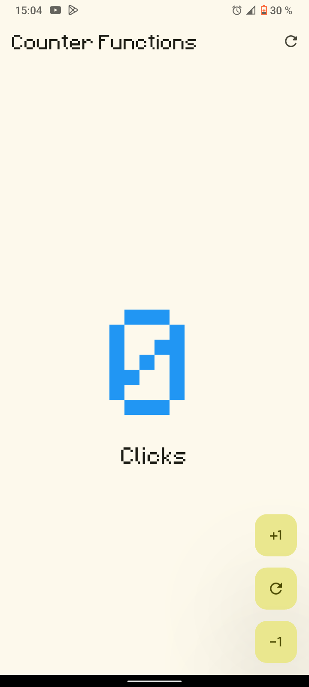
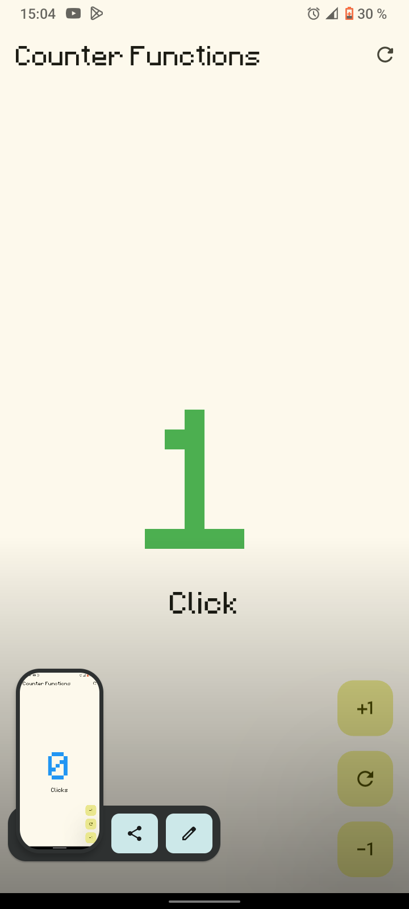
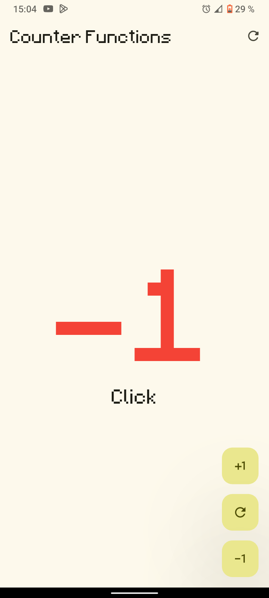

# hello_world_app 🚀

Esta aplicación es una práctica introductoria al framework **Flutter**. El objetivo principal de la práctica es comprender los fundamentos del desarrollo móvil con Flutter, explorando el uso de widgets (`StatelessWidget` y `StatefulWidget`). 

El resultado es una aplicación de un contador interactivo que permite sumar, restar, reiniciar y cuenta con la particularidad de admitir números negativos.

---

## 🎨 Diseño y Tipografía Personalizada

Para darle una identidad visual única a la aplicación y salir de las fuentes genéricas del sistema operativo, se integró una tipografía personalizada que le da un toque distintivo a la interfaz:

* **Fuente utilizada:** `minecraft_font` (en formato `.ttf`)[cite: 4].
* **Tipo y Estilo:** Es una tipografía de estilo *Pixel-Art* o *8-bits*. Pertenece a la categoría de fuentes *Display*, las cuales están diseñadas específicamente para usarse a tamaños grandes (como los números de nuestro contador), destacar y tematizar visualmente un entorno gráfico.
* **Integración Técnica:** El archivo de la fuente fue alojado de manera local dentro de los `assets` del proyecto. Posteriormente, se registró en el archivo de configuración `pubspec.yaml` para que la aplicación la compile de forma nativa, asegurando que los textos se rendericen instantáneamente sin necesidad de hacer peticiones web.
* **Impacto UI/UX:** Al aplicar esta estética retro a los botones y al número central del contador, se logró transformar una herramienta funcional básica en una interfaz con personalidad "gamer", haciéndola mucho más atractiva y divertida de usar.
* **Sitio de descarga:** https://fontmeme.com/fonts/minecraft-font/

---

## 📸 Evidencia Fotográfica

| Estado Cero | Números Negativos | Números Positivos |
| :---: | :---: | :---: |
|  |  |  |
| *Contador reiniciado en 0.* | *Contador operando en números negativos.* | *Contador incrementando en números positivos.* |

---

## 📊 Arquitectura del Proyecto

Puedes explorar la estructura y el diagrama interactivo de la aplicación generado con Archify directamente en la web:

[👉 Ver Diagrama Interactivo de Arquitectura en GitHub Pages](https://elmau0834x.github.io/Practicas_DMI_220859/Practica02/hello_world_app/estructura_completa_hello_world_app.html)