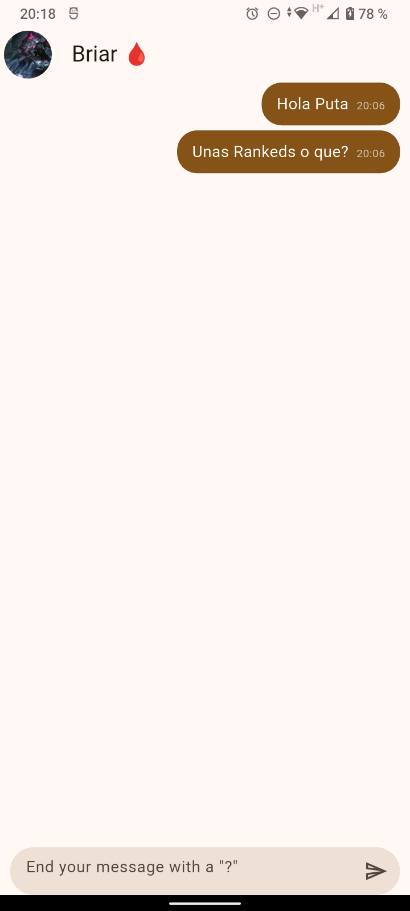
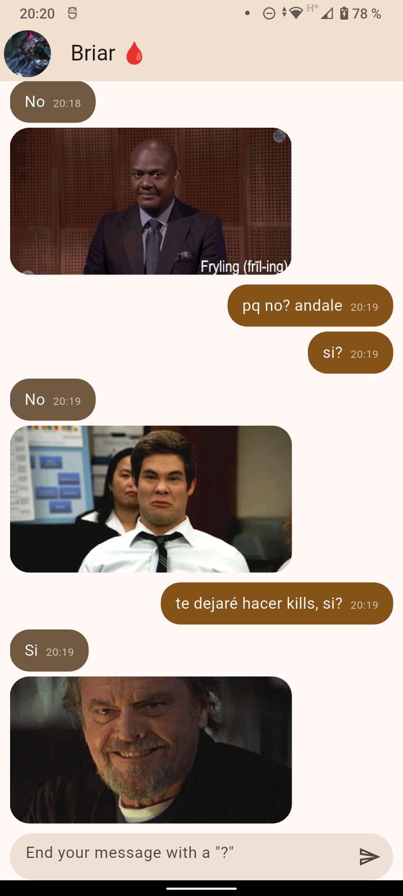
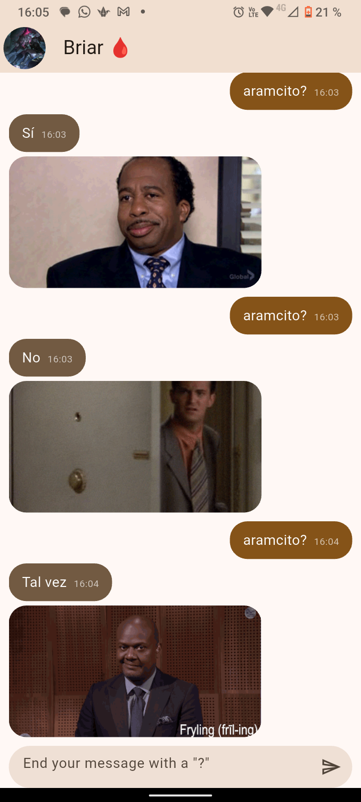

# yes_no_app 🩸💬

Esta aplicación es una práctica desarrollada en **Flutter** que simula un chat interactivo en tiempo real con el personaje de **Briar**. El objetivo principal de la práctica es comprender el consumo de APIs REST asíncronas mediante `Dio`, el manejo del estado global con `Provider` y la maquetación de interfaces tipo mensajería.

La aplicación responde de manera automática únicamente a preguntas que terminen con el signo `?`, consultando la API de **yesno.wtf** y desplegando un GIF animado junto con la respuesta traducida.

---

## ✨ Características Principales

* **Lógica de Probabilidad Personalizada:** Distribución matemática exacta de **40% Sí**, **40% No** y **20% Tal Vez** aplicada a las peticiones HTTP.
* **Diseño Estilo WhatsApp:** Burbujas de mensaje adaptativas con marca de tiempo (`HH:mm`) integrada en la esquina inferior mediante el widget `Wrap`.
* **Personalización Completa:** Tema visual con la paleta de colores del personaje, avatar personalizado e ícono de la aplicación generado con `flutter_launcher_icons`.
* **Arquitectura Limpia:** Separación de responsabilidades mediante capas (*Domain*, *Infrastructure*, *Presentation* y *Helpers*).

---

## 📸 Evidencia Fotográfica

| Vista del Chat | Respuesta Afirmativa (Sí) | Respuesta Negativa (No) | Respuesta Tal Vez (Maybe) |
| :---: | :---: | :---: | :---: |
| |  |  |  |
| *Interfaz principal del chat con marcas de hora.* | *Respuesta de la API con GIF animado (40%).* | *Respuesta de la API con GIF animado (40%).* | *Respuesta de la API con GIF animado (20%).* |

---

## 📊 Arquitectura del Proyecto

Puedes explorar la estructura y el diagrama interactivo de la aplicación generado con Archify directamente en la web:

[👉 Ver Diagrama Interactivo de Arquitectura en GitHub Pages](https://elmau0834x.github.io/Practicas_DMI_220859/Practica03/yes_no_app/estructura_completa_yes_no_app.html)